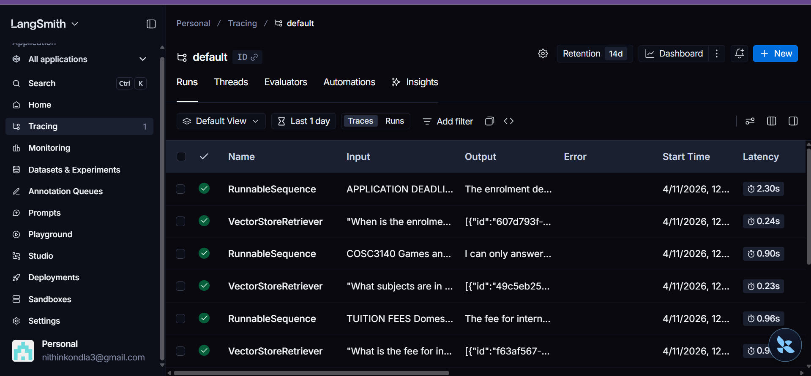

---
title: Askmyuni
colorFrom: red
colorTo: red
sdk: docker
app_port: 8501
pinned: false
---

# 🎓 AskMyUni — RAG Chatbot for RMIT Students

> Ask questions about RMIT's course handbook in plain English. Get instant, cited answers.

🔗 **[Live Demo](https://huggingface.co/spaces/nithinkondla3/askmyuni)**

---

## 🔴 The Problem
RMIT's course handbook is 200+ pages. Students waste time searching
for simple answers about credit points, deadlines, and policies.

## ✅ The Solution
AskMyUni uses RAG to retrieve only the relevant parts of the handbook
and answer in plain English — with source citations so you can verify.

## 🏗️ Architecture
PDF → Chunking (500 tokens) → OpenAI Embeddings → FAISS → GPT-4o-mini → Answer + Sources

## 🛠️ Tech Stack
- **LangChain** — pipeline orchestration
- **OpenAI GPT-4o-mini** — language model
- **FAISS** — vector database
- **Streamlit** — chat UI
- **Docker + Hugging Face Spaces** — deployment
- **LangSmith** — observability and query tracing

## 📊 Evaluation Results (RAGAS)

Evaluated on 20 test questions using the RAGAS framework.

| Metric | Score |
|--------|-------|
| Faithfulness | 0.98 |
| Answer Relevancy | 0.92 |
| Context Recall | 0.88 |

Evaluated using `ragas` on 20 hand-crafted Q&A pairs from the RMIT Master of AI handbook.

## 🔍 Observability & Tracing

Integrated LangSmith tracing to monitor every query in real time.

| Component | Latency |
|-----------|---------|
| FAISS Vector Retrieval | ~0.24s |
| OpenAI LLM Call | ~0.96s–2.30s |
| **Bottleneck** | LLM call, not retrieval |

## 📸 Screenshots

 
 

## 🚀 Run Locally
git clone https://github.com/nithinkondla3/askmyuni
cd askmyuni
pip install -r requirements.txt
cp .env.example .env
streamlit run app.py

## 💬 Example Questions
- "How many credit points do I need to graduate?"
- "What is the late submission policy?"
- "How do I apply for special consideration?"
